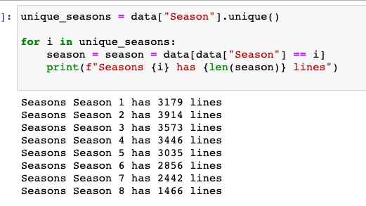

# Assignment 6: Text classification using Deep Learning

## Project description 
For this class assignment we were to develop an algorithm that could distinguish the different seasons of the TV series Game of Thrones based on the lines spoken in the manuscript. 

The data set we used can be found here: https://www.kaggle.com/albenft/game-of-thrones-script-all-seasons

Research question: 
* Can you predict which season a line comes from? Or to phrase that another way, is dialogue a good predictor of season?

Instructions: 
Start by making a baseline using a 'classical' ML solution such as CountVectorization + LogisticRegression and use this as a means of evaluating how well your model performs. Then you should try to come up with a solution which uses a DL model, such as the CNNs we went over in class.


## Methods
For this assignment I developed a script, which trains a baseline model and a CNN and outputs their performance scores in a classification report to the output folder. Both models use the same input: a data frame with all the spoken lines from the eight GOT seasons. When loading the data, it was split into a train and a test set with a 80/20 split. This was done before vectorization of the data to avoid any data leakage between the training and the test data. For the baseline model the data was preprocessed using count vectorization and a logistic regression model was used for classification. 

For the CNN the data preprocessing was a bit more extensive. The y-labels were onehot encoded using Sklearns OneHotEncoder. Additionally, the text data was first tokenized using the Keras Tokenize() function to create a vocabulary with maximum 500 words. In keras these numerical representations of texts are called sequences. Using the keras function pad_sequences() these tokenized sequences are then ‘padded’ with 0’s  so that all text lines get the length of max_length (here 200 words). These padded sequences were embedded with the Glove embedding, which is saved in the ‘glove’ folder at this repository. This embedding was the first of a convolutional neural network architecture, which also included a convolutional layer (Conv1D), a max pooling layer (GlobalMaxPool1D), a dense layer with 10 nodes and an output layer with 8 nodes (one for each output class). 

Apart from the classification reports for the baseline model and the CNN, the script also produces a visualization of the model architecture of the CNN and the training history of the CNN in the output folder.


## Usage
For this assignment a single command line scripts was created: 
* got_cnn.py
    * "--infile", required=False, help="Input path, training data", type = str, default="Game_of_Thrones_Script.csv" 
    * "--epochs", required=False, help="Train/test split input data", type=int, default=10
    * "--batchsize", required=False, help="Batchsize in model training", type=int, default = 32
    * "--embed_dim", required=False, help="Dimensions for storing pretrained word embeddings from glove", type=int, default = 50
    * "--path_glove_embedding", required=False, help="Path to the pretrained word embedding to use from glove", type=str, default = os.path.join("..","glove","glove.6B.50d.txt")

If you have successfully cloned this repository and created the virtual environment lang_venv you can run the preprocessing script from command line with:

```
$ cd language_exam
$ source lang_venv/bin/activate
$ cd assignment_6/src
$ python got-cnn.py

```

## Discussion of results
As can be seen from the classification reports from the output folder, neither of the models performed very well. The macro F1 score of the baseline model was 0.26 while it was actually even worse with a macro F1 of 0.18 for the CNN. Thus, despite using a pretrained embedding and a more sophisticated model architecture, this model was not able to find any patterns in the data which distinguish the eight seasons of GOT. When looking at the amount of data for each class, it is evident, that this data set is imbalanced:

  
  <p align="center"> </a> 

Thus, I also experimented with balancing the data set (see the commented-out lines in script) using the function balance_data(), but as this made performance even worse both for the baseline model (F1 = 0.22) and for the CNN (F1 = 0.15), I decided to leave this step out again. For the reference, classification reports for the balanced data set can also be found in the output folder. 
The lower performance could be attributed to so many data points being filtered out when balancing with the number of the smallest class. One could possibly also experiment with a balancing method, with resampling of data points for the classes with fewer data points (also called upsampling). Another possible extension of this analysis would be to stratify the training and the testing data by the output classes, to ensure that the distribution of data points from each class was the same in the training and the test set.  
Another interesting thing to look at would be to chunk the data points together in larger chunks, to avoid having data points that would only include a single word/sound like ‘uhm’. These very short sentences are likely to occur in the data set, as the data set consists in lines of spoken text. On the other end of the scale, there might also be long sequences of a single person speaking hundreds of words. Thus, the amount of information of a single data point can vary to a great extent, and accordingly the number of informative features that ends up in the training and the test set will also depend on how the random train/test split distributes the larger and the smaller sentences in the data set. 


