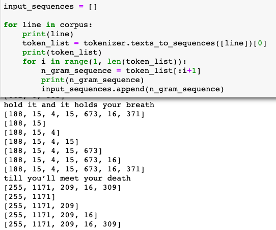
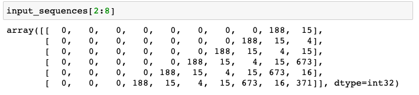
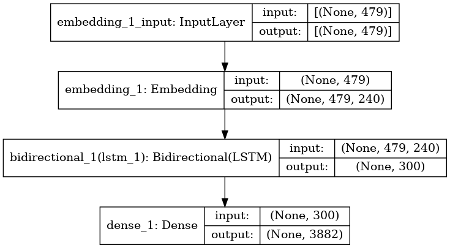
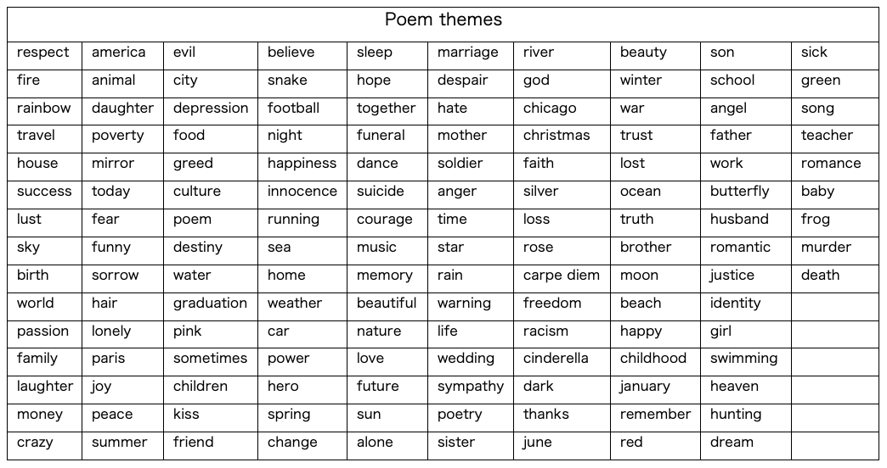
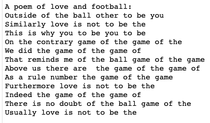
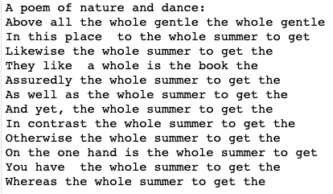
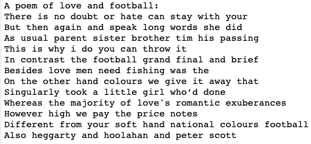
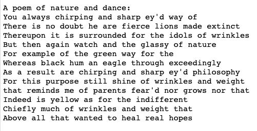
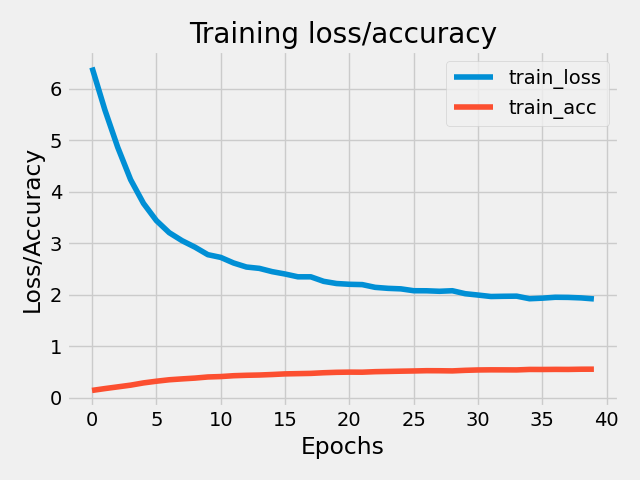

# Assignment 6: Shall I compare thee… to a football? 

## Project description 
For this final project I have chosen to work with text generation. More specifically, I have chosen to create a poem-generator, that can create theme-based poems (of varying quality…) using machine learning techniques. The project is inspired by a machine learning course by Keras (Moroney, 2020), which I have developed on. 

The script makes use of an open-source data set, which consists in 145 folders that each holds approximately 100 poems with a specific topic. The data set can be found
[_here_](https://www.kaggle.com/michaelarman/poemsdataset). From these 145 topics the user of the poem-generator can pick two themes for the poem that will be generated. In addition to picking two themes the user has to pick how many lines the poem should have and how many words there should be in each line.  


## Methods
#### 1. Loading and tokenizing text &nbsp;
When the script is run the poems with the two themes specified via command line are loaded from their folders. The poems are first gathered in one long text corpus with the load_poems() function. Then the corpus is split into individual text lines with lower case words, and these poem lines are then tokenized using Keras’ Tokenizer() in the tokenize_poems() function (returning a max of 5000 individual tokens).  
&nbsp;
&nbsp;

#### 2. Making text sequences &nbsp;
The preprocessed poem lines are then made into sequences of words, with the create_sequences() function: 1) Each line of the corpus is made into a token list using the indices from the token index dictionary constructed during tokenization. 2) Each token is then made into a n_gram_sequences. 

An intuitive understanding of the n-gram model is as follows: Out of the times you saw the history h, how many times did the word w follow it? E.g. out of all the time you see the word "I" how many times do the word "love" follow it? And out of all the times you see the words "I love" how many times does the word "you" follow them? (Kapadia, 2019).

Below is an illustration of how these word sequences look: 

&nbsp;
&nbsp;

<p align="center"> </a> 

&nbsp;
&nbsp;

Thus, the sentence ‘hold it and it holds your breath’ is made into a list of word indices (see the line just below). And the full line of word indices is then split into smaller sublists where one word (word-index) is added one by one to create a new sequence. If the model is good enough it can learn during model training to predict the next word index that is the most likely to be added to a sequence based on these word sequences. 

&nbsp;

#### 3. Pad sequences &nbsp;
After creating the words sequences, the sequences need to be padded with 0’s so the input data points to the model all have the same dimensions. Below is an illustration of how the sequences look when they are padded: 

&nbsp;
&nbsp;

<p align="center"> </a> 

&nbsp;
&nbsp;

#### 4. Split sequences in X and Y and train model &nbsp; 
When the sequences are padded in this way, where all the 0’s are added in the beginning, one can utilize the fact that the last word (to the very right) can be picked out using negative indexing. These numbers are the Y values of the model. The remainder indices (all the numbers to the left) can then be used as the X values. As described above, the model then has to learn that when seeing X (a series of words) the most likely next word is Y. It is these X- and Y- values that are fed to the model. 
The model used to train the poem-generator is a convolutional neural network with an input layer, an embedding layer that learns an embedding for all of the words in the poem corpus, a LSTM layer with 150 nodes, which is well-suited for predicting time-series data like predicting the order of words in poems, and a dense output layer (n.nodes = n.words in index dictionary). The model architecture of each trained model is saved in the output folder. An example output can be seen here:

&nbsp;
&nbsp;

<p align="center"> </a> 

&nbsp;
&nbsp;

#### 5. Create poem &nbsp;
When the model is trained, it can be used to generate new words when given a set of initiator words, from which it can predict the most likely next word. For this script I have used a list of words/word pairs that are commonly used to initiate sentences. These words are saved as a txt file in the utils folder (the original list can be found [_here_](https://owlcation.com/academia/Words-to-Use-in-Starting-Sentences)). Based on the number of lines the poem needs to have (specified by the user of the poem-generator) the script samples this number of sentence initiators and generates a poem line with a given number of words (also specified via command line). The generated poem is saved as a txt file in the output folder. 


## Usage
For this assignment a single command line scripts was created: 
* Poem-generator.py
    * "-t1", "--theme1", type = str, required=False, help="Theme 1 of your poem.", default="football"
    * "-t2", "--theme2", type = str, required=False,  help="Theme 2 of your poem.", default="love" 
    * "-l", "--lines", type = int, required=False, help="Number of lines in your poem.", default = 12
    * "-w", "--n_words", type=int, required=False, help="Number of words in each line of your poem.", default = 6
    * "-np", "--n_poems", type = int, required=False, help="Number of poems you want.", default = 5
    * "-e", "--epochs", type = int, required=False, help="Number of epochs for model training.", default = 10

If you have successfully cloned this repository and created the virtual environment lang_venv you can run the preprocessing script from command line with:


```
$ cd language_exam
$ source lang_venv/bin/activate
$ cd final_project/src
$ python poem-generator.py 

```

When run with default settings the script will create five poems about nature and dance, that all have 12 lines of each 6 words. The default model is trained with 10 epochs. As can be seen above you can specify another number of poems, number of lines and number of words per line in the poems. Additionally, if you wish to pick your own themes, you can pick two themes from the table below and specify them via command line:

&nbsp;
&nbsp;

<p align="center"> </a> 

&nbsp;
&nbsp;


## Discussion of results
As described above, the model is trained on n_gram sequences made from the poems of the two themes specified by the user. By feeding the model these sequences, it is the hope that the model can learn what word is the most likely to follow certain words and, in this way, begin to write sentences that make sense. And as the model is trained on poems with specific themes, the “writing style” of the model will hopefully reflect the themes of the poems it was trained on. 

When looking at the output of two trial rounds with the themes football+love and nature+dance it seems that the model is indeed able to learn a specific writing style. Clearly, the model is choosing different kinds of words even when it is only trained for one epoch:

&nbsp;
&nbsp;
  
  <p align="center"> </a>   <a align="center">  <p>
  <p align="center"><em> Output poem, themes: football+love, 1 epoch &nbsp;&nbsp; &nbsp; &nbsp; &nbsp; &nbsp; &nbsp; &nbsp; &nbsp; &nbsp; &nbsp; &nbsp; &nbsp; &nbsp; &nbsp; Output poem, themes: nature+dance, 1 epoch </em><p/>
  
  
  &nbsp;
  &nbsp;

  
  Additionally, when comparing the output from running the model with 1 epoch vs. 10 or 40 epochs it is clear that the model is learning about more and more words and how they appear in text through model training: 
  
  &nbsp;
  &nbsp;

  
  <p align="center"> </a>   <a align="center">  <p>
  <p align="center"><em> Output poem, themes: football+love, 40 epochs &nbsp;&nbsp; &nbsp; &nbsp; &nbsp; &nbsp; &nbsp; &nbsp; &nbsp; &nbsp; &nbsp; &nbsp; &nbsp; &nbsp; &nbsp; &nbsp; &nbsp; Output poem, themes: nature+dance, 10 epochs  </em><p/>
  
  &nbsp;
  &nbsp;
  
  Still, it is clear from the above that the model is mostly learning ‘buzz’ words from each theme and is only slightly improving its understanding of how words are related in a sentence. This makes sense as the model is only learning from approximately 200 poems. If one had used a pretrained word-embedding holding information about syntax to generate sentences, one could have had sentences with better syntax. Still, as it was the intention to deliberately bias the model towards using certain words, I found that it was more fun to simply let the model learn is learn from these smaller word corpora. 

Looking at the plots of model training history of the love+football model trained for 40 epochs shows that the model is learning, but also that the training accuracy is not improving substantially after 10/15 epochs. To have a better model it would naturally be of use to have more poems in each poem category. Possibly, one could combine the poems some of the categories like ‘romance’ and ‘love’ into a single theme folder to feed the model with more data.  

&nbsp;
&nbsp;
  
  <p align="center"> </a> 
  
  &nbsp;
  &nbsp;
  
Additionally, I think it could be interesting to look at using different words for initiating the sentences, when the poem-generator is starting to write a new line. As described, the model is randomly sampling from words that are common for initiating sentences. But these words might not be very ‘inspiring’ for the model when it has to initiate a sentence. If one wished to write a love poem it could make sense to force the model to initiate a number of sentences with ‘I’ and ‘you’, as these pronouns have likely been used to initiate sentences in many of the love poems that the model has been trained on. Another possibly development of the project is to look at the length of the lines in the poem. Possibly, it could make the poems more “poem-like” if the sentences were of varying length of e.g. 6-8-6-8 words.


### References: 
Brede, M. (2012). Networks—An Introduction. Mark EJ Newman.(2010, Oxford University Press.) ISBN-978-0-19-920665-0. MIT Press One Rogers Street, Cambridge, MA 02142-1209, USA journals-info

Kapadia, S. (2019). Language Models: N-Gram. A step into statistical language… | Towards Data Science. https://towardsdatascience.com/introduction-to-language-models-n-gram-e323081503d9
Moroney, L. (2020, maj 15). Training an AI to create poetry (NLP Zero to Hero—Part 6). https://morioh.com/p/c5c4a6aae0d5


